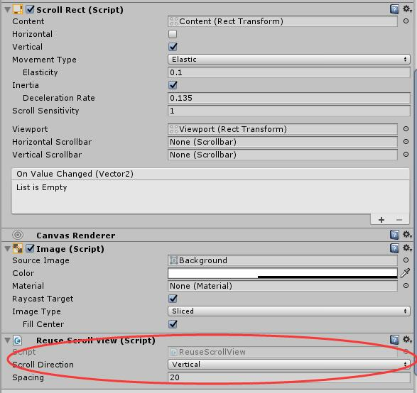
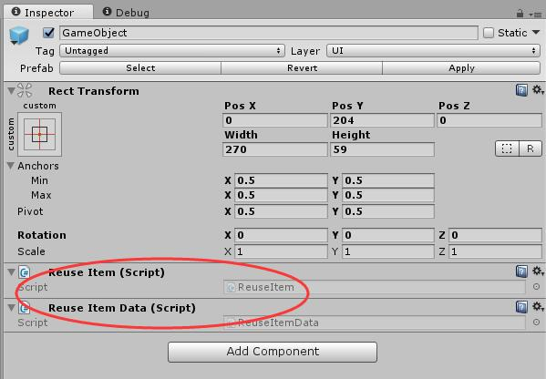
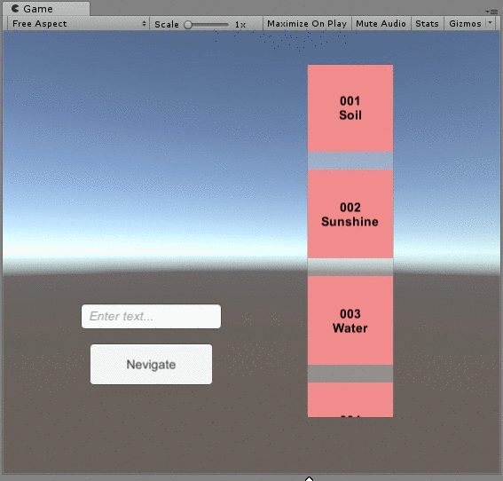
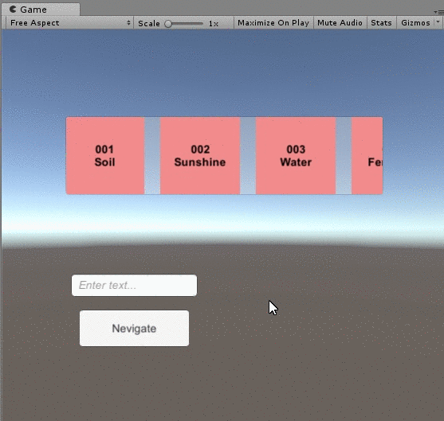

# Unity-ReuseScrollView

Unity3D使用ScrollView时，实现Item内容循环重复使用（**简单版本，Add即用，无需继承**）

### 1. 简介

在Unity3D中，使用ScrollView时，会生成一系列子物体进行滑动

（注：这些子物体在本文档及代码中称为 “Item”）

当Item过多时，可以根据**重复循环使用**视图内的Item，以节约资源

其中关键点，大致两点：

**第一，滑出去的Item 重新移位，衔接滑进来的效果**

**第二，随着一系列Item的不断滑动，要准确定位当前Item的索引**

脚本 `ReuseScrollView.cs`、`ReuseItem.cs`、 `ReuseItemData.cs`   则可以实现此功能。

### 2. 建议用法

- 第一步：将 `ReuseScrollView.cs` 挂在ScrollView上



其中，**Scroll Direction 为方向，Spacing 为间距**

- 第二步：在准备用来做 Item 的Prefab 挂上 `ReuseItem.cs`、 `ReuseItemData.cs`  



- 第三步：自定义 `ReuseItemData.cs` 数据 和 `UpdateSetDataToItem()` 方法

  示例 详见代码

- 第四步：调用 `BuildContent()` 即可

  ```c#
  void BuildContent(GameObject go, List<ReuseItemData> dataList, float spacing = 20.0f)
  ```

  示例 详见 `Test.cs` 

### 3. Demo及题外话


在 AssetStore 中也有类似的插件：

1. https://assetstore.unity.com/packages/tools/gui/infinity-scrollview-for-ugui-67771
2. https://assetstore.unity.com/packages/tools/gui/reusescroller-106279


---
***Update June 28, 2019***

### 4. Nevigate功能

由于Item是重复循环使用，无法指定某个Item定位，所以参数为 `index`

调用 `Nevigate()` 即可

```c#
void Nevigate(int index)
```


- index：第index个数据（**从1开始**）

- 为实现平滑移动定位效果，使用了**DoTween**插件

- 如果需要 **非循环使用Item的scrollView**  实现Nevigate功能

	可参照 <https://github.com/LaiYizhou/Unity-ScrollViewNevigation>
	
	   
	
	






